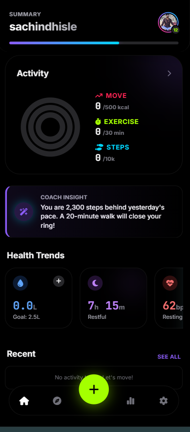

<div align="center">

# 💪 FitTrackerPro

### A Modern Fitness & Health Tracking Web App

Track your daily fitness, workouts, hydration, sleep, calories and progress — all in one beautiful dashboard.


</div>

---

# ✨ Features

- 📊 Beautiful Dashboard UI
- 🔥 Daily Activity Rings
- 🚶 Step Counter
- 💪 Exercise Tracking
- 🔥 Calories Burned
- 💧 Water Intake Tracker
- 😴 Sleep Tracking
- ❤️ Heart Rate Card
- 📈 Health Trends
- 🧠 Smart Coaching Insight
- 🌙 Premium Dark Mode
- 📱 Mobile First Design
- ⚡ Fast & Lightweight
- 🎨 Apple Fitness Inspired Interface

---

# 📸 Preview

<p align="center">

</p>

---

# 🚀 Tech Stack

- HTML5
- CSS3
- JavaScript (Vanilla)

---

# 📱 Responsive

✔ Mobile

✔ Tablet

✔ Desktop

---

# 📂 Project Structure

```
FitTrackerPro/
│
├── index.html
├── README.md
└── assets/
```

---

# 🎯 Future Updates

- ✅ User Login
- ✅ Firebase Sync
- ✅ Weekly Reports
- ✅ Achievement Badges
- ✅ Health Analytics
- ✅ Dark / Light Theme
- ✅ PWA Support
- ✅ Offline Mode
- ✅ AI Health Coach

---

# 🌟 Why FitTrackerPro?

FitTrackerPro is designed to provide a clean, modern, and intuitive fitness tracking experience inspired by premium health applications. It helps users monitor their daily activities while maintaining a beautiful and lightweight interface.

---

# ❤️ Support

If you like this project,

⭐ Star this repository

🍴 Fork it

📢 Share it with others

---

<div align="center">

## 👨‍💻 Developer

### **Sachin Dhisle**

Crafted with ❤️ using HTML, CSS & JavaScript.

---

### ⭐ Thanks for Visiting ⭐

</div>
